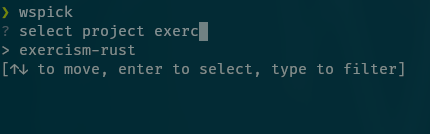

# wspick
terminal workspace picker



-----
## Installation
`cargo install wspick`

-----
## Usage
Calling wspick opens a selector with projects that can be opened in a configured editor.
New projects can be added by selecting new and specifing path and name or by editing the config directly

```bash
wspick
? select project  
> [new]
  [edit]
[↑↓ to move, enter to select, type to filter]
```

### Parameters
- `-p` print the selected path instead of opening it. Useful for usage in scripts.

### CD to projects
To use it on linux to cd to projects create the following alias:
```bash
alias cdws='cd $(wspick -p)'
```
-----
## Config
On first start a new configfile `wspick.toml` is generated and stored in an appropriate location. On linux this is `~/.config/wspick`
```yaml
open_cmd = ""
editor = "/usr/bin/helix"
sort = true

[paths]
exercism-rust = "/home/manuel/programming/exercism/rust"
```

- `open_cmd`: command that is executed on selection. Empty means printing the selected path
- `editor`: editor used when you select edit
- `sort`: wheter to sort prjects alphabetically
- `paths`: list of project names and paths
